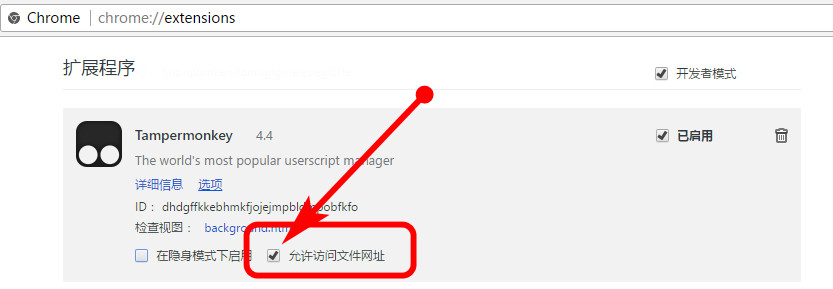
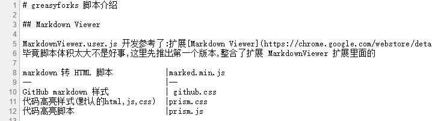
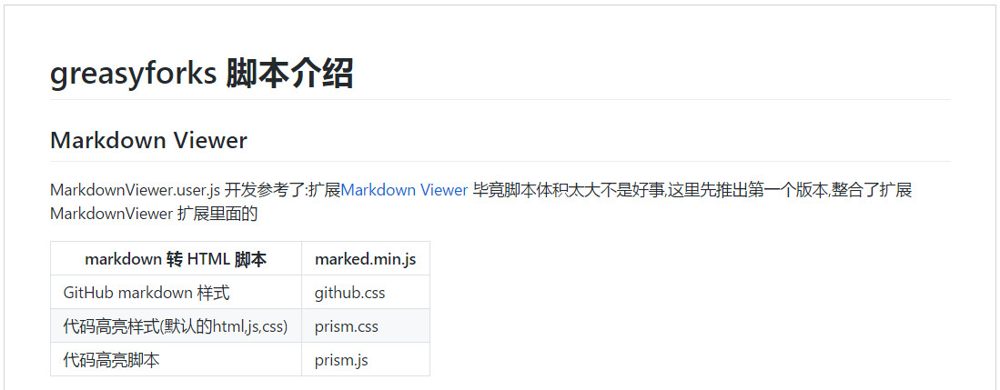

# greasyforks 脚本介绍

## Markdown Viewer

MarkdownViewer.user.js 开发参考了:扩展[Markdown Viewer](https://chrome.google.com/webstore/detail/markdown-viewer/ckkdlimhmcjmikdlpkmbgfkaikojcbjk)
毕竟脚本体积太大不是好事,这里先推出第一个版本,整合了扩展 MarkdownViewer 扩展里面的

markdown 转 HTML 脚本			 |marked.min.js 
--                               |--
GitHub markdown 样式 			 | github.css
代码高亮样式(默认的html,js,css)	 |prism.css
代码高亮脚本						 |prism.js
如果脚本要产生作用,需要在 [菜单]→[更多工具]→[扩展程序E] 找到 [Tampermonkey]→勾选☑允许访问文件网址

**浏览器原本打开效果**

**启用脚本后打开效果**

